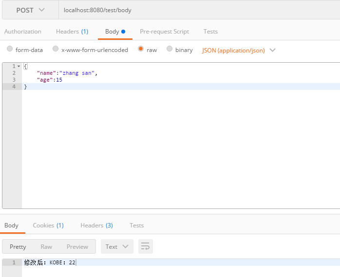

### 前言
&emsp;&emsp;本文通过我在实际开发中遇到的一个问题，从而对`HttpServletRequest`重复使用请求数据的问题进行讲解，看完本文你将了解到：
- 如何从zuul网关的filter中截取`HttpServletRequest`的请求数据，并保证可以重复使用。  
- `HttpServletRequest`原理分析及如何用一个普通过滤器捕获客户端请求，并对数据修改后再传给服务器。  

### 问题描述
&emsp;&emsp;在实际开发中可能存在这样的需求：将客户端的请求信息，包括headers，body，queryParams等信息拦截下来，然后再根据一些具体的业务需要，对请求的字段进行过滤或者是处理。但是`HttpServletRequest`接口中，并没有为我们暴露相应的set方法，仅有如下两个个set方法：  
```Java
public void setAttribute(String name, Object o);
public void setCharacterEncoding(String env);
```
官方这么做的目的，一是保证数据的安全，本来这个数据就是客户端传过来的，不能让我们随意进行修改；二是防止在修改过程中出现错误数据，因为人为的修改总有可能会出错。  
&emsp;&emsp;我遇到的问题是，在zuul网关中，使用filter来拦截客户端的请求，将客户端的请求信息都保存到数据库，作为调用记录。由于客户端使用PSOT请求方式的时候，请求体是放在`HttpServletRequest.getInputStream()`中的，但是这是一个流(只能读一次)，如果我在filter中读了之后，那么后续到达实际的接口的时候，请求体中的流就为空了，然后接口因为识别不了请求体而报错。

### 解决办法
&emsp;&emsp;其实在zuul网关中解决这个问题很好办，因为zuul已经为我们实现了一个`HttpServletRequestWrapper`,我们只需要使用这个包装类中的方法就可以，里面的方法都是可以多次使用的，包括`getInputStream()`方法。先看看如何解决上面的问题，后面再说原理。直接上filter中的代码：
```Java
public class TestZuulFilter extends ZuulFilter {
  @Override
  public boolean shouldFilter() {
      return true;
  }
  @Override
    public String filterType() {
        return FilterConstants.PRE_TYPE;
    }
    @Override
    public int filterOrder() {
        return 4;
    }
    @Override
    public Object run() {

        //1、从上下文中拿到HttpServletRequest对象
        RequestContext currentContext = RequestContext.getCurrentContext();
        HttpServletRequest request = currentContext.getRequest();
        //2、使用zuul自带的包装类HttpServletRequestWrapper
        HttpServletRequestWrapper wrapper = new HttpServletRequestWrapper();
        //3、将HttpServletRequestWrapper放入上下文代替HttpServletReques作为后续使用
        currentContext.setRequest(wrapper);
        //4、这个时候你就可以尽情的使用wrapper中的数据了，无论使用多少次都可以
        byte[] content = wrapper.getContentData();
        ServletInputStream contentInputStream = wrapper.getInputStream();
        //....
    }
}
```
关于zuul中的filter的使用这里我就不讲了，感兴趣的可以去搜一下，网上对zuul网关中filter的用法讲解的博文有很多。上面说了`HttpServletRequestWrapper`是zuul为我们实现的一个包装类，它的位置在`com.netflix.zuul.http.HttpServletRequestWrapper`中，那它是如何实现可以多次读取客户端请求数据的呢？来看一看它的部分源码：
```Java
public class HttpServletRequestWrapper extends javax.servlet.http.HttpServletRequestWrapper {

  private HttpServletRequest req;
   private byte[] contentData = null;
   private HashMap<String, String[]> parameters = null;

   //构造方法
   public HttpServletRequestWrapper(HttpServletRequest request) {
        super(request);
        req = request;
    }

private void parseRequest() throws IOException {
        ByteArrayOutputStream baos = new ByteArrayOutputStream();
            try {
                // Copy all bytes from inputstream to byte array, and record time taken.
                long bufferStartTime = System.nanoTime();
                IOUtils.copy(req.getInputStream(), baos);
                bodyBufferingTimeNs = System.nanoTime() - bufferStartTime;

                contentData = baos.toByteArray();
            } catch (SocketTimeoutException e) {
                // This can happen if the request body is smaller than the size specified in the
                // Content-Length header, and using tomcat APR connector.
                LOG.error("SocketTimeoutException reading request body from inputstream. error=" + String.valueOf(e.getMessage()));
                if (contentData == null) {
                    contentData = new byte[0];
                }
            }
            //后续略
}
    public byte[] getContentData() {
            return contentData;
        }
        @Override
        public ServletInputStream getInputStream() throws IOException {
            parseRequest();

            return new ServletInputStreamWrapper(contentData);
        }
        @Override
    public BufferedReader getReader() throws IOException {
        parseRequest();

        String enc = req.getCharacterEncoding();
        if (enc == null)
            enc = "UTF-8";
        return new BufferedReader(new InputStreamReader(new ByteArrayInputStream(contentData), enc));
    }
    @Override
    public String getParameter(String name) {
        try {
            parseRequest();
        } catch (IOException e) {
            throw new IllegalStateException("Cannot parse the request!", e);
        }
        if (parameters == null) return null;
        String[] values = parameters.get(name);
        if (values == null || values.length == 0)
            return null;
        return values[0];
    }
    @SuppressWarnings("unchecked")
    @Override
    public Map getParameterMap() {
        try {
            parseRequest();
        } catch (IOException e) {
            throw new IllegalStateException("Cannot parse the request!", e);
        }
        return getParameters();
    }
}
```
&emsp;&emsp;从源码中我们可以看到它是继承与`javax.servlet.http.HttpServletRequestWrapper`类，复写了父类中的一些方法，自身持有三个属性：`HttpServletRequest req`,`byte[] contentData`,`HashMap<String, String[]> parameters`.每一个复写的方法中，都调用了一个私有的`parseRequest()`方法。这个也是重点，在构造方法中，将客户端传来的request对象赋值给了自己的属性req，然后自身对req对象进行操作。实际上就是将req流中的信息缓存到contentData数据中，这样我们就可以重复使用数据了。

### 原理
&emsp;&emsp;zuul为我们提供的包装类，实际上就是编写一个继承与`javax.servlet.http.HttpServletRequestWrapper`的类，然后将客户端请求的流数据缓存到数组中，这样就可以对数据重复使用了。如果你学过设计模式，那么从名字你肯定知道这是一个装饰模式，那它的结构到底是怎么样的呢，如下图所示：  
  
具体设计模式的知识我会另外写一个系列的文章，这里我就不多展开了。上图大致是一个UML图，其结构和层次也很清晰，我们只需要重写父类中的一些方法，就可以达到重复使用请求参数的目的。这个就是zuul网关为我们实现的一个装饰类，但是如果我们的项目不是基于zuul网关，就是普通的mvc结构，我们也有前面所说的需求，我们应该怎么做呢？。  
&emsp;&emsp;下面我以一个mvc结构的工程中实现截取客户端请求，然后修改请求体内容，最终传给controller的例子，来演示一下解决办法。  

自定义的包装类：
```Java
public class CustomHttpServletRequestWrapper extends javax.servlet.http.HttpServletRequestWrapper {
  private HttpServletRequest request;
      private byte[] rawData;


      public HttpServletRequestWrapper(HttpServletRequest request) {
          super(request);
          this.request = request;
          parseRequest();
      }


      public HttpServletRequest getRequest() {
          return this.request;
      }

      public byte[] getRawData() {
          return this.rawData;
      }

      public void setRawData(byte[] data) {
          this.rawData = data;
      }

      private void parseRequest() {

          //----------------------------解析请求体------------------------------------------------

          ByteArrayOutputStream bos = new ByteArrayOutputStream();
          try {
              ServletInputStream input = request.getInputStream();
              if(input == null) {
                  rawData = new byte[0];
              }
              int len = 0;
              byte[] buffer = new byte[DEFAULT_BUFFER_SIZE];
              while((len=input.read(buffer)) != -1) {
                  bos.write(buffer, 0, len);
              }
              rawData = bos.toByteArray();
          } catch (IOException e) {
              e.printStackTrace();
          }

          //----------------------------解析param------------------------------------------------
          //略

      }


      @Override
      public ServletInputStream getInputStream() {
          return new ServletInputStream() {
              ByteArrayInputStream bis = new ByteArrayInputStream(rawData);
              @Override
              public int read() throws IOException {
                  return bis.read();
              }

              @Override
              public void setReadListener(ReadListener listener) {

              }

              @Override
              public boolean isReady() {
                  return false;
              }

              @Override
              public boolean isFinished() {
                  return false;
              }
          };
      }

      @Override
      public BufferedReader getReader() throws IOException {
          String charset = request.getCharacterEncoding() == null ? "UTF-8" : request.getCharacterEncoding();
          return new BufferedReader(new InputStreamReader(new ByteArrayInputStream(rawData),charset));
      }
}
```
包装类中我只对流数据进行了方法重写，还有一些方法，比如获取getParameter()等方法，根据需求自行复写这些方法就行了。  

定义一个web filter，用来拦截请求，这里我是继承了`OncePerRequestFilter`实现的一个web filter.然后对截取到的request进行包装，然后再从包装类中取出请求体，对请求体进行修改。  

web过滤器：
```java
@Configuration
public class ModifyRequestBodyFilter extends OncePerRequestFilter{

    @Override
    protected void doFilterInternal(HttpServletRequest request, HttpServletResponse response, FilterChain filterChain)
            throws ServletException, IOException {
        HttpServletRequestWrapper wrapper = new HttpServletRequestWrapper(request);
        byte[] rawData = wrapper.getRawData();
        ObjectMapper mapper = new ObjectMapper();
        User user = mapper.readValue(rawData, User.class);
        user.setAge(22);
        user.setName("KOBE");

        wrapper.setRawData(mapper.writeValueAsBytes(user));
        filterChain.doFilter(wrapper, response);
    }

}
```

定义一个controller，去验证客户端传来的请求体是否已经被修改了  
```java
@RestController
public class TestController {

    public static final Logger LOG = LoggerFactory.getLogger(TestController.class);

    @PostMapping("/test/body")
    public String updateRequestBody(@RequestBody User body) {
        LOG.debug("得到修改后的请求体，并返回值");
        String result = "修改后：" + body.getName() + "：" + body.getAge();
        return result;
    }
}
```
然后我们使用postman发起一个请求，请求内容和结果如下所示，我们可以看到结果却是是按照我们在web filter中修改的内容来显示的。


### 总结
&emsp;&emsp;在解决过程中其实还遇到过一点问题，就是在复写`getInputStream()`方法的时候，我是按照zuul实现的那个一样，对inputStream进行了一次包装，但是在controller的时候解析不出来，开始一直不知道什么原因。后来就没有对inputStream进行包装了，直接在复写方法的时候实现ServletInputStream接口中的方法，就解决了。至今我也没找到为什么按照zuul那样对流包装一次，就导致解析不到了。

### 工程地址
Github：<https://github.com/byeluliangwei/web-development>

### 参考
简书： <https://www.jianshu.com/p/85feeb30c1ed>  
博客：<http://blog.51cto.com/983836259/1877592>
