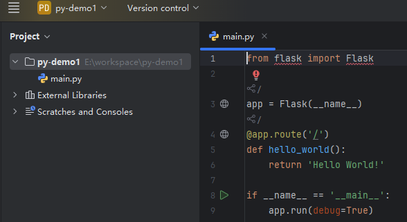
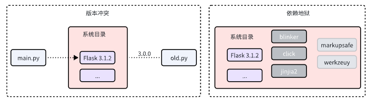
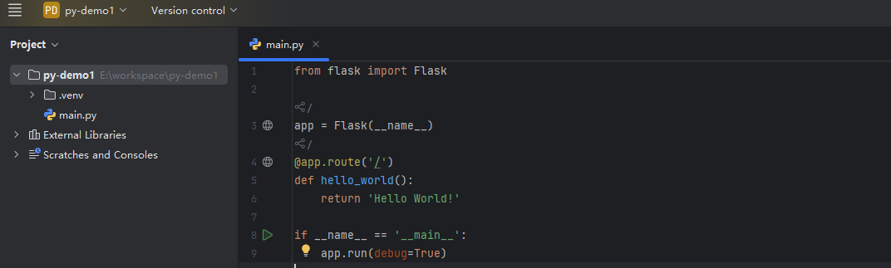
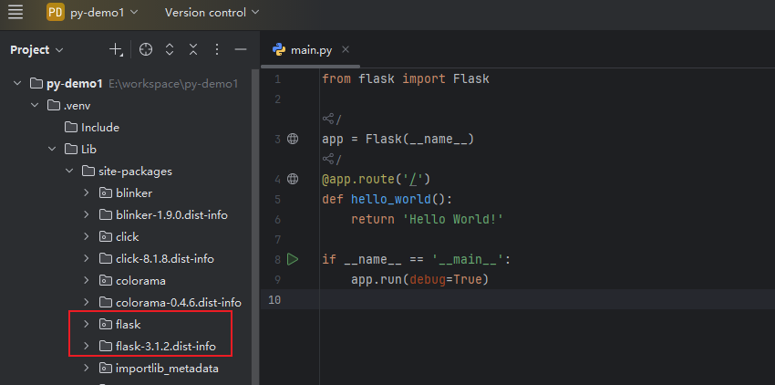
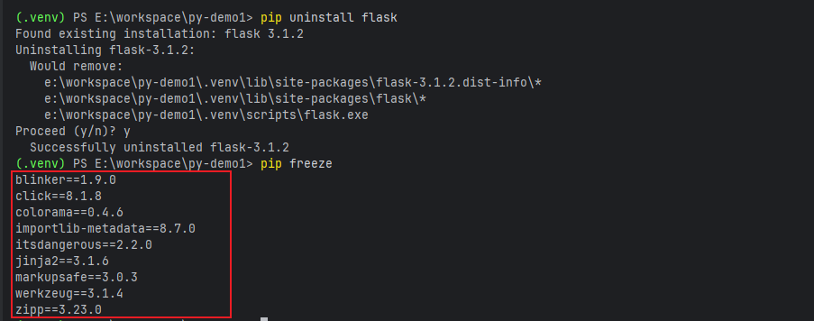
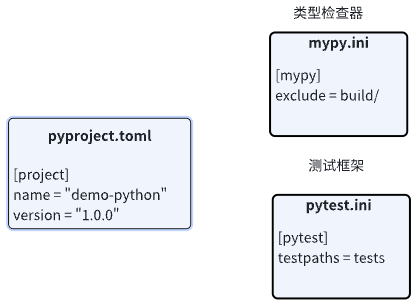
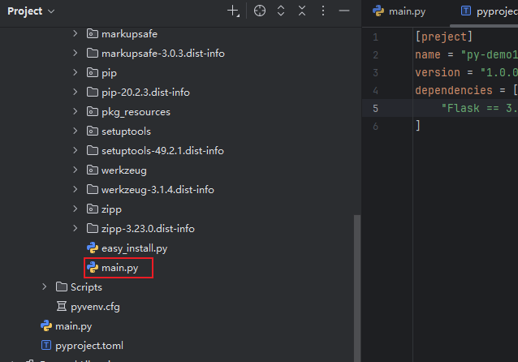
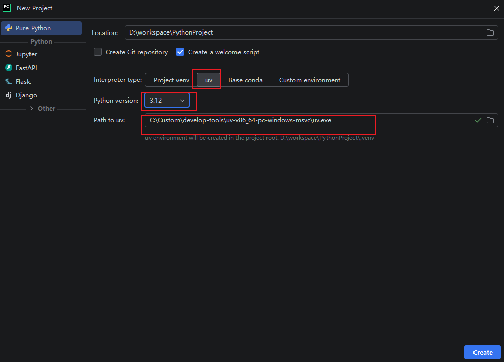
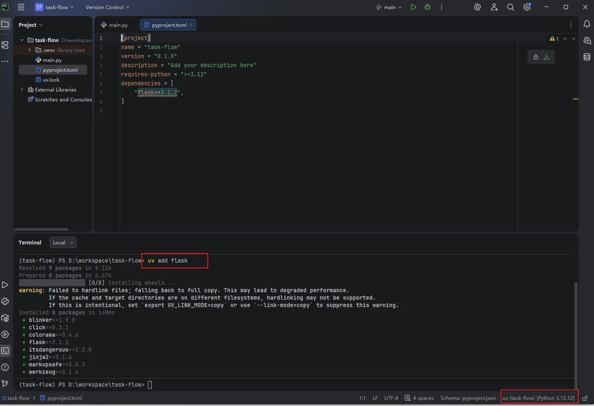

## 1 前言
最近项目上用到了python，作为之前一直将python拿来写点小脚本的小白，都是直接在一个文件中写好需要实现的功能，本地直接用pip安装需要用到的依赖包， 
然后能run起来就可以了。但是在工程实践中如何像Java项目那样来管理python项目的包呢，为了搞清楚各种包管理工具pip，uv，poetry，conda之间的关系， 
今天就跟我一起来把它们彻底搞清楚。

## 2 从demo开始
为了弄清楚我们如何正确规范的管理一个python项目，以及常见的一些python项目中的包管理原理，我们从一个实际的例子开始：


这个python工程中只包含了一个main文件，仅仅引入了一个flask依赖，写了一个hello world。此时由于没有flask依赖，所以项目运行会报错。你的第一反应
是不是也是直接执行如下命令pip3 install flask安装一下就完美解决了？确实，这样项目可以成功运行，但是存在一个问题，如下终端显示：
```shell
PS E:\workspace\py-demo1> pip3 show flask
Name: flask
Version: 3.1.2
Summary: A simple framework for building complex web applications.
Home-page: None
Author: None
Author-email: None
License: None
Location: d:\program files\python\lib\site-packages
Requires: werkzeug, click, importlib-metadata, blinker, markupsafe, jinja2, itsdangerous
Required-by: 
PS E:\workspace\py-demo1> 
```
我们刚才安装的Flask包被安装到了python的全局路径下（标黄的部分），此时电脑上的所有项目都共享该Flask依赖，例如我这里是3.1.2，那么就代表所有项目
用到的Flask都是这个版本。 

这样就会带来两个问题：
> - 版本冲突
> - 复杂的依赖关系



如图所示，当我们有两个项目都在依赖Flask且版本不一致时，此时发生依赖冲突；而一个依赖可能又会有它自己的其他依赖包，导致更多的冲突，完全无法管理。
那么如何解决这个问题呢，那就是**虚拟环境**。

## 3 虚拟环境
虚拟环境就是为了解决上面出现的问题而出现的，它的作用就是为每一个项目创建一个独立且干净的依赖环境，实现项目之间的依赖隔离。

虚拟环境的创建有两种方式：
- 命令创建：`python3 -m venv .venv`
- IDEA创建项目的时候自动创建。



两种创建方式效果一样，创建完成后我们的项目根目录下就多了一个`.venv`文件夹。这里的`.venv`就是虚拟环境的名字，虽然也可以取其它，但是不建议这样做。 
现在的很多IDE都能识别这个`.venv`名字的目录作为我们的虚拟环境，如果我们在命令行执行，则需要执行如下代码让环境生效：
```shell
# linux激活虚拟环境
source .ven/bin/activate
# windows激活虚拟环境（正常IDEA可以识别，无需手动激活）
./venv/Scripts/activate
```
此时我们再执行`pip3 install flask`命令安装依赖，就会安装到我们的虚拟环境目录下了。


到这里我们就解决了每个项目维护自己专属的依赖库，而没有了冲突的烦恼。
> **虚拟环境底层原理：**
> 
> 主要是修改了python中`sys.path`这个变量，这个变量的值是一个列表，里面记录了python再导入模块时需要搜索的文件夹路径。当我们import依赖时，
> python就会逐个搜索这些路径，直到找到import的包。 
> 
> 虚拟环境被激活后，我们得到虚拟目录会被添加到`sys.path`这个搜索列表。这样就可以搜索到 虚拟目录下的依赖包了。 
> 
> 当没有虚拟目录时，`sys.path`包含的是我们python的全局目录。

这就完了吗？显然没有！试想一下，Java项目中我们使用maven来管理依赖，别人看到我们的项目时，可以清晰的看到pom中依赖的版本和名称，那么python中如何
把我们的项目依赖这样清晰的展示给别人呢？总不能一行行的执行`pip install`命令吧（虽然我这样干过）。

早期的做法是使用`pip freeze`命令，它可以打印出当前虚拟环境中所有已经安装好的包和他们的版本号：
```shell
(.venv) PS E:\workspace\py-demo1> pip freeze
blinker==1.9.0
click==8.1.8
colorama==0.4.6
flask==3.1.2
importlib-metadata==8.7.0
itsdangerous==2.2.0
jinja2==3.1.6
markupsafe==3.0.3
werkzeug==3.1.4
zipp==3.23.0
```
然后把这些包信息重定向到一个名叫`requirements.txt`的文件中，然后别人就可以看到你依赖的软件包，当别人需要在自己的环境运行你的项目时，
执行`pip install -r requirements.txt`就可以轻松安装依赖了。

现在很多开源项目中也仍然使用的是这样的方式，包括我司现在也是这样的方式在管理项目依赖。但是这样有一个很大的**缺陷**：
> `pip freeze`无法分清哪些是我们项目的直接依赖，哪些是这些依赖引入的间接依赖。

如上面的执行结果，我的项目中仅仅依赖到了一个Flask包，但是导出的包却有很多间接依赖。当项目比较复杂的时候，管理起来就会失控，你会陷入各种各样的安装
依赖错误的问题中。（我曾深陷其中无法自拔）

另外一个问题就是，当我们执行卸载操作的时候，pip只会移除你指定的包本身，那些间接依赖是不会被删除的，这就会在我们的项目中成为没人使用的孤儿。


我直接说解决办法，那就是`pyproject`。

## 4 pyproject
现代python项目通常是使用`pyproject.toml`来解决`pip freeze`带来的孤儿依赖和间接依赖问题。这个文件是官方指定的统一配置文件。在它成为标准之前，
不同的开发工具通常有各自独立的配置文件，如下图：


当项目中使用的工具增多时，根目录下就会出现大量零散的配置文件。现在python生态中大多数工具都支持了`pyproject.toml`，所以我们就只需要维护这一个配
置文件就可以了。

我们只需要在`pyproject.toml`配置文件中添加一个`dependencies`配置，就可以替代`requirements.txt`了，如下所示：
```plantuml
[project]
name = "demo-python"
version = "1.0.0"
dependencies = [
    "Flask == 3.1.2"
]
```
我们只需要在配置中声明项目的直接依赖Flask即可，而不用关心那些间接依赖了。如果我们想要删除该依赖，直接在配置文件中删除Flask这一行配置就好了，不会
留下任何孤儿依赖。

依赖写好后我们只需要执行：`pip install .`就可以安装依赖了。这里的`.`代表当前目录。
```shell
(.venv) PS E:\workspace\py-demo1> pip install .
Processing e:\workspace\py-demo1
  Installing build dependencies ... done
  Getting requirements to build wheel ... done
    Preparing wheel metadata ... done
Building wheels for collected packages: main
  Building wheel for main (PEP 517) ... done
  Created wheel for main: filename=main-0.0.0-py3-none-any.whl size=1161 sha256=02b04b5edaf569687e0c570c8028a4af0ced71cc99beb0f4178bba3cf340fd27
  Stored in directory: c:\users\luliangwei\appdata\local\pip\cache\wheels\42\bd\c4\e961192f846b57e5f0fbca35aa9fcb80d94c81ac2a5c21d492
Successfully built main
Installing collected packages: main
Successfully installed main-0.0.0
```
通过上述日志打印，可以看到实际执行了两个步骤:
- 打包当前目录为python标准软件包；(Created wheel for main)
- 安装该软件包，并把声明的依赖一并安装进来；(Installing collected packages: main)

这样会带来一个在**开发阶段**比较麻烦的新问题，那就是我们的源代码文件也会被安装到虚拟环境中的目录中。如下图所示，我的源代码`main.py`文件被安装到了
虚拟环境的`site-packages`目录中。


这样我们的项目中就存在两份相同的`main.py`文件，如果我们修改了源代码，这个代码并不会自动同步到虚拟环境中。所以我们需要在安装依赖时带上一个参数，
这样就不会把源代码复制到`site-packages`目录中了。
```shell
# 解决源码文件安装到环境目录中的问题
pip install -e .
```
## 5 回顾一下
在前面的步骤中，我们用`.venv`环境冲突问题，用`pyproject.toml`解决了依赖管理问题。当你以为大功告成的时候，现实却给你当头一棒。因为此时你会发现，我们
安装软件包不能再像以前一样直接执行`pip install xxx`来安装了，每次安装包前，我们都需要去官网找到软件包的名称，然后找到对应的版本号，将它写到
`pyproject.toml`文件中，这样既容易出错，又不专业。此时你可能以为肯定官方提供了完成这个过程的方式，不用我们手动操作，但实际上是：**没有！！！**

**虽然官方没有提供，但是社区有啊！！！**

社区为我们提供了更高级的管理工具，如：`poetry`，`uv`，`PDM`。可以把它们理解为对venv和pip的高级封装，下面我们就继续一探究竟。

## 6 更高级的管理
### 6.1 uv
仍然以前面的用例来学习，我们将之前安装的所有东西都去掉，只在项目中保留`main.py`和一个项目配置文件`pyproject.toml`，并且该配置文件中，只包含了项目
名称和版本号。按照我们之前手动安装依赖的方式，有如下几步：
```shell
# 1. 创建虚拟环境
python -m venv .venv
# 2. 使虚拟环境生效
source .venv/bin/activate
# 3. 手动编辑配置文件，添加Flask依赖和版本号
edit project.toml
# 4. 安装依赖
pip install -e .
```
现在你可以忘了她（它）了。我们直接一条命令就可以完成上面的所有步骤：
```shell
uv add flask
```
当别人拿到我们的项目时，只需要执行`uv sync`，就可以自动创建虚拟环境并安装好相应的依赖了。此时就是如何启动项目的问题了，我们可以用如下两种方式来运行：
```shell
# 1. 使用传统方式
source .venv/bin/activate
python main.py
# 2. 直接使用uv启动(推荐)
uv run main.python
```
关于uv的安装方式，可以看看官方文档：https://uv.doczh.com/getting-started/installation/

我们可以直接在[github release](https://github.com/astral-sh/uv/releases)上下载对应的软件包进行安装，并配置环境变量。也可以使用官方提供
的安装脚本进行安装：
```shell
# windows安装
powershell -ExecutionPolicy ByPass -c "irm https://astral.sh/uv/install.ps1 | iex"

# linux安装
curl -LsSf https://astral.sh/uv/install.sh | sh

# 也可以指定版本安装
curl -LsSf https://astral.sh/uv/0.7.4/install.sh | sh
```
接下来我们来一个实战，看看如何在pycharm中创建一个python项目，并且使用`uv`进行依赖管理


pycharm会自动识别我们系统的`uv`，如果没有识别到，则自行指定`uv`的目录即可。创建好项目后，`uv`就会自动给我们创建好`.venv`目录
和`pyproject.toml`来管理依赖了。创建好的如下截图所示：

